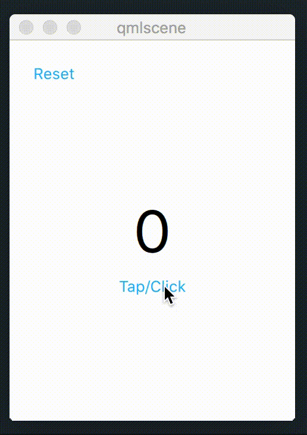

# Intro to QML

- QML is a declarative language.
- QML works with hierarchy of elements.
- Everything is (should be) relative.

```qml
// Minimum.qml
import QtQuick 2.10

Item {
    width: 300
    height: 300

    Rectangle {
        width: 100
        height: 100
        anchors.centerIn: parent
        color: "pink"

        Text {
            anchors.centerIn: parent
            text: "Ho hey!"
        }
    }
}
```

## QML Syntax

QML has a similar syntax to CSS.

```css
// CSS
h1 {
    color: red;
    font-size: 3em;
    text-decoration: underline;
}
```

```qml
// QML
Text {
    // Note that semicolons are not used in QML.
    color: "red"
    text: "Hello World!"
    font {
        pixelSize: 13
        underline: true
    }
}
```

Every QML document starts with an import statement and defines **only one** top
level item.

```qml
import QtQuick 2.12
import MyModule 1.0
import YourModule 1.0 as YM

Item {
    id: root
}
```

```qml
// Error!
import QtQuick 2.12

Item {
}

Rectangle {
}
```

## Anatomy of a QML Document

```qml
import QtQuick 2.12

Item {
    // (1) A unique identifier for this object.
    id: root

    // (2) Custom properties
    property int headerHeight: 20

    // (3) Alias to another property.
    property alias title: lbHeader.text

    // (4) Assigning integer to property. QML is type-safe.
    width: 300
    height: 300
    focus: true // We'll cover this later. It is used to receive input events.
    // (5) Attached properties
    Keys.onUpPressed: root.headerHeight += 10
    Keys.onDownPressed: root.headerHeight -= 10
    // (6) Group notation
    font {
        family: "Consolas"
        pixelSize: 13
    }
    font.family: "Consolas"

    // (7) Children items
    Rectangle {
        width: 300
        // (8) Bind the rectangle's height to headerHeight
        height: root.headerHeight

        Text {
            id: lbHeader
            x: 10
            y: 10
        }
    }

    // (9) Semicolon can be used to group properties together.
    Rectangle { id: semiRect; width: 300; height: 300; color: "red" }
    Item {
        x: 30; y: 10
        width: 10
    }
}
```

1- `id` properties are used to reference items in the same QML document.
   `id` needs to be unique and hey are not accessible from outside of the
   document.
2- You can add custom properties to your QML type to do additional customization.
   Custom properties can be accessed from outside of the QML document.
3- Alias properties are a special type of property. They enable you to expose
   the properties of a child item to the outside world. You cannot alias to
   a property that doesn't exist.
4- Type safety means you cannot assign a string to a property that expects an
   integer.
5- Attached properties are also special. They are attached to the element itself
   and are unique to the attached element.
6- Some properties provide additional sub-properties, like `font`. And they can
   be manipulated using two different methods: Dot notation and group notation.
   For multiple assignments, prefer group notation.
7- QML works with a hierarchy of nested elements. The child items are only
   available in the current QML document and cannot be accessed from outside.
8- A property can depend on the value of another property. This is called
   binding. They are super useful and they are the reason why QML is declarative.
9- Semicolon can be used to write multiple properties in one line.

Click on the following links:

- [Z-Order Example](Samples/ZOrderExample.qml)
- [Question](Questions/AnatomyOfQML.qml)

# Anchors

- Each item can be thought of as having a set of 7 invisible "anchor lines":
    + `left`
    + `horizontalCenter`
    + `right`
    + `top`
    + `verticalCenter`
    + `bottom`

```
            Left      Right
              |    |    | |
              |    |    | -> Top Margin
              |    |    | |
          ----x----x----x---- Top
              |\ \ |\ \ |
              | \ \| \ \|
 Left <-- |---x----x----x---- Vertical Center
Margin        |\ \ |\ \ |
              | \ \| \ \|
          ----x----x----x---- Bottom
              |    |    | |
              |    |    | -> Bottom Margin
              |    |    | |
```

- Each anchor line also has an associated margin value.
    + `leftMargin`
    + `horizontalCenterOffset`
    + `rightMargin`
    + `topMargin`
    + `verticalCenterOffset`
    + `bottomMargin`
- You can only anchor an item to its siblings and direct parent.

```qml
Item {
    id: root
    width: 300
    height: 300

    // Bad code
    Item {
        id: group1

        Rectangle { id: rect1; }
    }

    Item {
        id: group2

        Rectangle { id: rect2; anchors.left: rect1.right } // Invalid anchor!
    }
}
```

- Do not use bindings to set anchors.

```qml
Rectangle {
    width: 50; height: 50
    // Evaluation order is undefined, and you might get unexpected
    // size for the items.
    anchors.left: state == "right" ? undefined : parent.left;
    anchors.right: state == "right" ? parent.right : undefined;
}
```
- [Anchor Changes Example](Samples/AnchorChanges.qml)

# Basic Types

- QML has a list of basic types that are used to define properties.
- Since QML also has a JavaScript engine, JS types are also supported.
    + `Date`, `String`, `Array` etc.
- Some types are only specific to QML.
    + `point`, `size`, `color`, `rect`, `enumeration`

```qml
// Types.qml. Basic types examples
import QtQuick 2.10

Item {
    property string title: "Here be Title"
    property int magicNumber: 32
    property real magicNumber: 3.2
    property size backgroundSize: Qt.size(50, 50)

    property point pointOfInterest: Qt.point(0, 32)
    property color prettyColor: "brown" // Hex colors are also supported.
    property MyCustomItem customItem

    property int faultyIntAssignment: "123" // Error!
    property size faultySize: 32, 32 // Error!

    enum Theme {
        Classic,
        Modern,
        HIG
    }

    // Enums don't have a special property type.
    // You can use int to represent them.
    property int selectedTheme: Types.Classic
    property list<Rectangle> rectangles: [ // Lists are special
        Rectangle { color: "red" },
        Rectangle { color: "blue" }
    ]
    // If you are storing basic types, use a var instead.
    property var numbers: [5, 4, 7, 8, 3, 0, 9]
    // var also supports dictionaries.
    property var dictionary: {
        "schwannoma": "A neoplasm originating from Schwann cells of neurons."
        "nested": {
            "objects": "are also possible."
        },
        // QML objects can also be stored.
        "blue_rectangle": blue_rectangle
    }

    Rectangle { id: blue_rectangle; color: "blue" }
```

# Properties Overview

- A property is an attribute of an object that can be assigned a static value
or bound to a dynamic expression.
- The syntax for declaring properties:

```qml
[default] property <propertyType> <propertyName>
property int magicNumber: 32
```

- Each property implicitly defines a value-change signal associated with itself.

```qml
// Explicit signal decleration
signal worldEnded()

// The default signal handled.
onWorldEnded: {

}

property int allowedRowCount: 3

onAllowedRowCountChanged: {
    // This block of code is executed whenever the value of allowedRowCount
    // changes.
}

property point mousePosition: Qt.point(0, 0)

onMousePositionChanged: {
    // This block of code is executed whenever the value of mousePosition
    // changes and whenever one of its attributes changes.

    mousePosition = Qt.point(32, 32) // Signal emitted.
    mousePosition.x = 32 // Signal emitted.
}
```

- Use `var` type to declare generic properties.

```qml
// Use var only when you have to.
// Prefer declaring the properties with the proper type.
property var generic: 32 // Acceptable
property int generic: 32 // Better

property var generic: "32" // Acceptable
property string generic: "32" // Better

property var generic: Qt.point(32, 32) // Acceptable
property point generic: Qt.point(32, 32) // Better

// You have to use var for dictionaries.
property var words: {
    "ho": "hey!"
}
// You have to use var for lists of arbitrary data or primitives.
property var bucketList: ["Meet RDJ and pretend to be uninterested."]
```

- Any additional QML object type can be used to declare properties.

```qml
property Rectangle background
property Text textItem
```

- Bindings are expressions that describe a property's relationship with other
properties.

```qml
property int height: 30
property int width: height * 1.2
property int radius: width / 2
```

- Use `alias` to expose a property.

```qml
// Button.qml
import QtQuick 2.10

Item {
    // Cannot refer to a property that doesn't exist.
    property alias backgroundColor: background.color
    // Cannot refer to nested properties
    property alias borderColor: background.border.color // Error!
    property alias border: background.border // Works!

    Rectangle {
        id: background
    }
}

// MainWindow.qml
import QtQuick 2.10

Item {
    Button {
        backgroundColor: "red"
        border {
            width: 32
            color: "pink"
        }
    }
}
```

- Default properties. A QML document can have only have one default property.

```qml
// MyLabel.qml
import QtQuick 2.10

Text {
    default property var someText

    text: "Hello, " + someText.text
}

// MainWindow.qml
import QtQuick 2.10

Item {
    MyLabel {
        Text { text: "world!" }

        Text { text: "world!" } // A second item causes an error.
    }

    MyLabel {
        someText: Text { text: "world!" }
    }
}
```

Default properties are useful when you want to change the default
parent of a custom component.

```qml
// Custom.qml
import QtQuick 2.10

Item {
    id: root

    default property alias defaultParent: container.data

    Rectangle {
        id: container
        x: 100
        y: 0
        width: parent.width - x
        height: parent.height
        color: "red"
    }
}
```

- We can also use `readonly` keyword to declare read-only properties.

```qml
// Surface.qml
import QtQuick 2.10

Item {
    // Cannot be changed after the initialization.
    // It has to be initialized in declaration.
    readonly property int surfaceArea: width * height
}
```

## Assigning Values to Properties

Two ways to assign a value:
    + Declarative assignment. (aka Assignment on initialization.)
    + Imperative assignment.

```qml
// MyRectangle.qml
import QtQuick 2.10

Rectangle {
    property color borderColor: "red" // A static value
}

// MyWindow.qml
import QtQuick 2.10

MyRectangle {
    id: root
    width: 300 // A static value
    height: width * 2 // A binding value
    borderColor: "blue" // A static value

    Button {
        onClicked: {
            root.height = 150 // A static value. We no longer have a binding.
        }
    }
}
```

## Binding Loops

This can happen if we bind `propertyA` to affect `propertyB` and also bind
`propertyB` to affect `propertyA`. They would constantly update each other

```qml
import QtQuick 2.10

Rectangle {
    // Rectangle's width depends on the width of its children.
    width: childrenRect.width

    Text {
        // When the parent's width changes, it causes the text to change.
        // Which in turn causes the parent's width the change and so on.
        text: parent.width > 10 ? "Hello World" : "Hi"
    }
}
```

# QML Global Object

- `qsTr`: Used to create translatable text.

```qml
Text {
    text: qsTr("Hello World!")
}
```

- `console`: Used to print text to the console window.

```qml
console.log("Here be logs.")
console.assert(someCondition, "someCondition does not evaluate to true.")
console.time("firstFunction")
// Some long running operating.
console.timeEnd("firstFunction")
console.count("Ghostbusters called.")
```

+ `Qt.darker`

```qml
property color backgroundColor: "red"
property color backgroundShade: Qt.darker(backgroundColor, 1.5)
```

+ `Qt.font`

```qml
Text {
    font: Qt.font({"family": "Consolas", "pointSize": 13})
}
```

+ `Qt.lighter`

```qml
property color backgroundColor: "red"
property color backgroundLight: Qt.lighter(backgroundColor, 1.5)
```

+ `Qt.point`

```qml
// To access: mousePosition.x and mousePosition.y
property point mousePosition: Qt.point(13, 12)
```

+ `Qt.rect`

```qml
// To access: rectangle.x and rectangle.y
// And rectangle.width, rectangle.height
property rect rectangle: Qt.rect(13, 12, 50, 50)
```

+ `Qt.rgba`

```qml
property color backgroundColor: Qt.rgba(0.4, 0.5, 0.3, 1.0)
```

+ `Qt.size`

```qml
// To access: backgroundSize.width and backgroundSize.height
property point backgroundSize: Qt.size(13, 12)
```

# Creating Custom Components

QML provides a few ways to create a reusable component:

1- Using a `Component` object.
2- Using a file-based approach.
3- Creating the component from a string.

## Component Object Approach

A `Component` object wraps any `Item` based object and makes it reusable.
A `Component` object is not a visual item.

When you need to use a `Component`, you either instantiate it manually, or use
it alongside a `Loader`.

```qml
// main.qml
Item {
    id: root
    width: 500
    height: 500

    Loader {
        // Loader also has a `status` property that reports the current status
        // of the Loader. You can use this property to show a loading animation
        // until the object is completely instantiated.
        anchors {
            top: parent.top
            left: parent.left
            right: parent.right
            bottom: parent.verticalCenter
        }
        sourceComponent: cmp
        onLoaded: {
            // The `item` property of the `Loader` references the instantiated
            // object inside `Loader`. In this case, it is the rectangle.
            item.text = "My Worse Half" // (1)
        }
        asynchronous: true // This is false by default.
        onStatusChanged: {
            // This block of code does the same thing as (1)
            if (status === Loader.Ready) {
                item.tex = "My Even Worse Half"
            }
        }

        MouseArea {
            anchors.fill: parent
            onClicked: {
                // The second parameter of createObject takes in the values
                // for properties that the Rectangle has.
                cmp.createObject(root, {
                    "text": "My Better Half",
                    "color": "#388E3C",
                    "anchors.top": root.verticalCenter,
                    "anchors.left": root.left,
                    "anchors.right": root.right,
                    "anchors.bottom": root.bottom
                })
            }
        }
    }

    // You will not see a red rectangle with this code.
    Component {
        id: cmp

        Rectangle {
            property alias text: lb.text

            width: 200
            height: 200
            color: "#E53935"

            Text {
                id: lb
                anchors.centerIn: parent
            }
        }
    }
}
```

## File Based Approach

When the `Component` based approach is used, that component is local to the
document it belongs to. If we had another file alongside `main.qml` and we
wanted to use that component, we would not be able to use it because as we
discussed before, child objects are local to the file they belong to.

> **Question:** There's actually a way that you can use the component outside
of the file. Can you guess how?

With the file based system, each file constitutes a component.

```qml
// YourRectangle.qml
Rectangle {
    property alias text: lb.text

    width: 200
    height: 200
    color: "#E53935"

    Text {
        id: lb
        anchors.centerIn: parent
    }
}
```

Now, we can use that file in the same directory like its a built-in type.

```qml
// main.qml
import QtQuick 2.10

Item {
    id: root
    width: 500
    height: 500

    YourRectangle {
        anchors.fill: parent
    }
}
```

There's one important factor with the file-based approach: You have to have
proper access to the file. If `main.qml` and `YourRectangle.qml` are in the
same directory, you automatically get access to the file.

```
MyProjectDirectory
|__ main.qml
|__ YourRectangle.qml
```

But if we have a project structure like follows:

```
MyProjectDirectory
|__ main.qml
|__ Components
|__|__ YourRectangle.qml
```

We would get an error like this:

> file://MyProjectDirectory/main.qml:7 YourRectangle is not a type

This is because QML doesn't know where that file is. The solution is a very
simple import statement to let the QML engine know where to look for that item.

```qml
import QtQuick 2.10
import "Components"

Item {
    id: root
    width: 500
    height: 500

    YourRectangle {
        anchors.fill: parent
    }
}
```

There is one other way of importing a directory: `import Components 1.0`
This requires the use of `qmldir` files. We will covers this later.

## Creating the Component From a String

This is almost never be used in any situation. But there may be cases where you
might end up having to do so.

```qml
import QtQuick 2.10

Item {
    id: root
    width: 500
    height: 500

    MouseArea {
        anchors.fill: parent
        onClicked: {
            Qt.createQmlObject(
            'import QtQuick 2.0; Rectangle {color: "red"; width: 90; height: 90}',
            root)
        }
    }
}
```

This method requires that you keep track of the life time of the object that you
created. It is truly a maintenance hell, and it is very unlikely that you would
end up using this.

# Exercise

Create a tap counter with a reset button. It has a `Text` in the middle and
every time it's clicked on, it increments the number that it shows.

- Bonus: Implement it using both declarative and imperative approach.
- Bonus: Implement it using a custom button component.
- Additional Bonus: Change the color of the button when pressed and hovered.

**Hint**: You can use `MouseArea` for click handling.



# Additional Resources

Here is some related bits from the official QML documentation. You can use these resources to go into more detail.

You'll find that the information provided in these pages go into technical details. There are many cases where a concept is not really useful for design purposes.

- [First Steps With QML](https://doc.qt.io/qt-5/qmlfirststeps.html)
- [QML Reference](https://doc.qt.io/qt-5/qmlreference.html)
    + [QML Syntax](https://doc.qt.io/qt-5/qtqml-syntax-basics.html)
    + [Basic Types](https://doc.qt.io/qt-5/qtqml-typesystem-basictypes.html)
    + [Property Binding](https://doc.qt.io/qt-5/qtqml-syntax-propertybinding.html)
    + [Property Attributes](https://doc.qt.io/qt-5/qtqml-syntax-objectattributes.html#property-attributes)
    + [QML Documents](https://doc.qt.io/qt-5/qtqml-documents-topic.html#syntax-of-the-qml-language)
